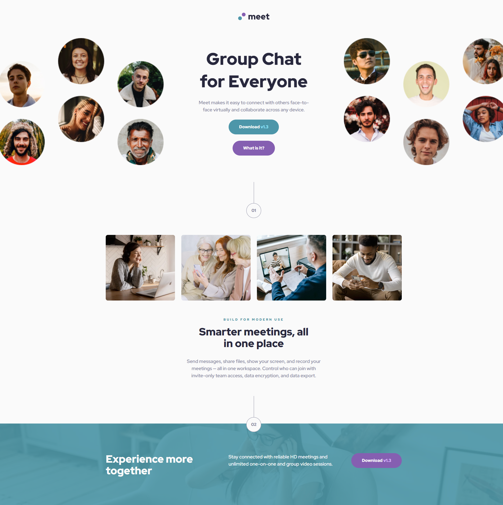

# Meet Landing Page

This repository contains the code for the Meet Landing Page project, a frontend challenge from [Frontend Mentor](https://www.frontendmentor.io). The goal of this project is to create a responsive landing page based on the provided design.

## Table of Contents

- [Overview](#overview)
- [Features](#features)
- [Technologies Used](#technologies-used)
- [Setup](#setup)
- [Project Structure](#project-structure)
- [Usage](#usage)
- [Screenshot](#screenshot)
- [Contributing](#contributing)
- [License](#license)

## Overview

The Meet Landing Page is a single-page application designed to showcase the features of a fictional meeting app. The design is responsive and works well on both desktop and mobile devices.

## Features

- Responsive design
- Modern UI/UX
- Cross-browser compatibility

## Technologies Used

- HTML5
- SCSS
- JavaScript
- Vite

## Setup

To get a local copy up and running, follow these steps:

1. Clone the repository:
   ```sh
   git clone https://github.com/marcel-schmidt-dev/meet-landing-page.git
   ```
2. Navigate to the project directory:
   ```sh
   cd meet-landing-page
   ```
3. Install the dependencies:
   ```sh
   npm install
   ```
4. Start the development server:
   ```sh
   npm run dev
   ```

## Project Structure

The project directory structure is as follows:

```
meet-landing-page/
├── public/
│   ├── index.html
│   └── assets/
│       └── images/
├── src/
│   ├── components/
│   ├── styles/
│   ├── App.js
│   ├── index.js
│   └── main.scss
├── .gitignore
├── package.json
├── README.md
└── vite.config.js
```

- `public/`: Contains the static files such as the HTML template and images.
- `src/`: Contains the source code for the application, including components and styles.
- `.gitignore`: Specifies files and directories to be ignored by Git.
- `package.json`: Lists the project dependencies and scripts.
- `README.md`: Provides an overview and instructions for the project.
- `vite.config.js`: Configuration file for Vite.

## Usage

To view the landing page, follow these steps:

Open your web browser and navigate to `http://localhost:3000` to view the landing page.

## Screenshot



## Contributing

Contributions are welcome! Please fork the repository and create a pull request with your changes.

## License

This project is licensed under the MIT License. See the [LICENSE](LICENSE) file for details.
